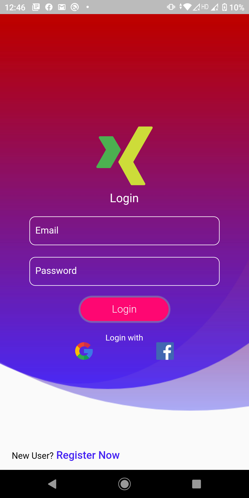
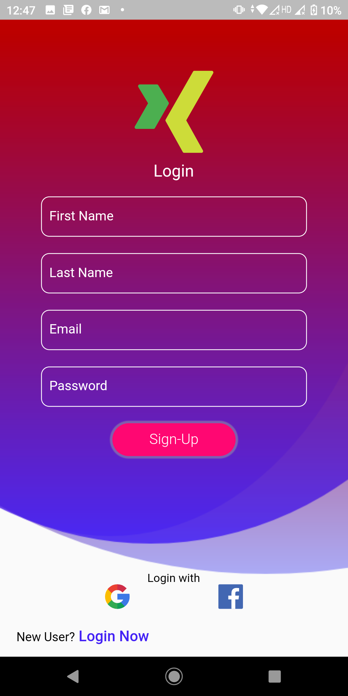

# flutter_login_ui

A new Flutter Login Registration UI design
- [Flutter Login Register Page UI Design using Velocity X](https://protocoderspoint.com/flutter-login-register-page-ui-design-adobexd-using-velocity-x-library/)

## Getting Started

This project is a starting point for a Flutter Login Registration UI design.

A few resources to get you started if this is your first Flutter project:

- [Lab: Write your first Flutter app](https://flutter.dev/docs/get-started/codelab)
- [Cookbook: Useful Flutter samples](https://flutter.dev/docs/cookbook)

For help getting started with Flutter, view our
[online documentation](https://flutter.dev/docs), which offers tutorials,
samples, guidance on mobile development, and a full API reference.

   
